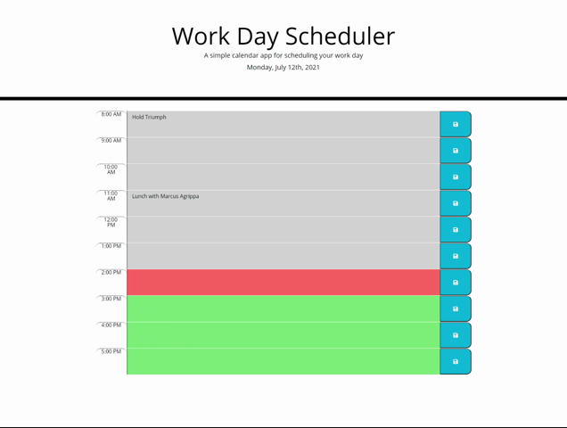

## Planner Utility
<pre>
<a href='https://github.com/ZakkFast/PlannerUtility'>GitHub Repo</a>
<a href='https://zakkfast.github.io/PlannerUtility/'>Planner Utility</a>
</pre>

### The purpose of the application
<pre>
 The Planner Utility allows the user to save reminders, appointments, or any other text based information in an online document. The codument is laid out by time of day and uses an external library to kept track of time. This allows the user to see if times blocks are past, current, or in the future all by color code. Appointment data is saved in the user's browser's local storage and will be recalled when the page is either refreshed, or re-opened.
</pre>

### How to use this application

<pre>
The planner is fairly straight forward and intuitive. The user can see the current date at the top along with Time Blocks in the center of the page. On the left side of each time block the suer can find the time for said block. Once the user knows what time they would like to save they simply enter text in the middle colored bar and clicks the save button on the right hand side.
</pre>

### Requirements
<pre>
The web application can run in any of the following web browsers running on the specified operating systems:

Microsoft Edge (latest publicly-released version) running on Windows 10, Window 8.1, Windows 8, Windows 7

Mozilla Firefox (latest publicly-released version) running on Windows 10, Windows 8.1, Windows 8, or Windows 7

Google Chrome (latest publicly-released version) running on Windows 10, Windows 8.1, Windows 8, Windows 7

Google Chrome (latest publicly-released version) running on the two latest publicly-release Mac OS versions

Apple Safari (latest publicly-released version) running on the two latest publicly-release Mac OS versions, or Apple iPad

A PC or Mac that isnt a potato.
</pre>

### Contact

Email: ZakkFastPro@gmail.com 
Twitter: https://Twitter.com/ZakkFast 
GitHub: https://github.com/ZakkFast 
